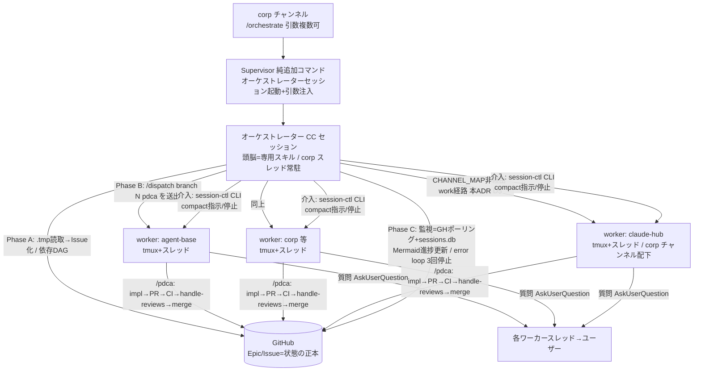

# ADR-002: corp オーケストレーション全体設計と claude-hub work セッション経路（#208 案B の決着）

## Status

**Accepted**

本 ADR は 2 つの決定を 1 ファイルに束ねる:

1. **全体設計**: `/orchestrate` によるマルチワーカー並列実行アーキテクチャと、オーケストレーターの責務境界・状態管理・並列上限
2. **claude-hub work セッション経路**: #208 案B（CHANNEL_MAP 非経由の work セッション新設）を採用し、ワーカースレッドは **corp チャンネル**に立てる

## Context

corp チャンネルから複数タスク（保存済み handoff `.tmp` / Issue 番号 / 自然言語）を一括で渡し、並列セッションが自律実行して PR→merge まで進むオーケストレーション機能が求められている（Epic #316、発端: 2026-07-05 の「4 handoff を同時並列実行して」要望）。

2026-07-05 のコード棚卸しで判明した現状:

- **ワーカー相当は既存 `/dispatch` がほぼ充足**: `/dispatch <branch> <issueNumber> [selector]` は対象チャンネルの mapped repo に worktree セッションを立て、`/<command> <issueNumber>` を初期プロンプトとして注入する（`supervisor/src/session/dispatch.ts:302-369`）。selector `pdca` を渡せば plan→impl→verify→handle-reviews→merge の一気通貫がセッション内で動く（`dispatch.ts:71-97` の closed set）。FIFO キュー（`supervisor/src/session/dispatch-queue.ts`）、沈黙 2h + busy 子プロセス無しの自動回収（DispatchHealthReaper, `supervisor/src/config/channels.ts:173-185`）、done ラベル検出停止（GoalWatcher, `channels.ts:155-160`）、headless executor（`dispatch.ts:48-59`、opt-in）が既存
- **未実装は「1 つの CC セッションが他セッションを起動・監視する」オーケストレーター概念のみ**: sessions.db に親子・依存カラムは無く、dispatch は fire-and-forget
- Supervisor に PR/merge 系機能はゼロ → merge 遂行はワーカー内 `/pdca` に委譲する

一方、claude-hub 自身へのタスク投入には**絶対ルール**が立ちはだかる:

> Channel-Supervisor の `CHANNEL_MAP` に `claude-hub` を追加してはいけない（`docs/bot-operations.md`「絶対ルール」）

`supervisor/src/config/channels.ts:141-147` はこれを FATAL guard として機械化しており、`CHANNEL_MAP.has("claude-hub")` が真なら Supervisor 起動自体を throw で止める。dispatch のチャンネル解決は `CHANNEL_MAP.get(channelName)`（`supervisor/src/bot.ts:514-516`。未登録チャンネルは not handled）であるため、**claude-hub チャンネル経由の `/dispatch` は構造的に不可能**。これは defect ではなく、Supervisor クラッシュ時の Discord 復旧経路（claudeHubExit = hijoguchi、`--channels` 直結で Supervisor 非依存）を独立に保つための設計判断である（メタ依存の防止）。

#208 はこのトレードオフを「案A: 結線しない（現状維持）/ 案B: 復旧経路と分離した work セッションを新設して dispatch 可能にする（要 ADR）」として整理し、2026-06-10 に owner 判断で案A を採用して close された。ただし決定コメントに「将来 手動運用が辛くなれば再検討」とあり、Epic #316 のオーケストレーション要件（claude-hub を含む全 repo への並列投入）がまさにその再検討トリガーである。本 ADR が案B の設計を確定する。

## Decision

### D1. 全体アーキテクチャ

Epic #316 本文の構成図を正式版として採録する:

- **入力**: `.tmp` パス / `repo#issue` / 自然言語の混在可。`.tmp` は着手時に Issue 化して永続化する（Supervisor に handoff `.tmp` を読む経路は作らず、オーケストレーター CC セッションが自分で読んで Issue 化する）
- **ワーカー形態**: 既存 `/dispatch`（tmux + スレッド）+ `/pdca` 注入を再利用。新規ワーカー機構は作らない
- **既存機能は非破壊（純追加）**: `/session start|resume|list|stop|status|compact`・`/dispatch`・relay・各 watchdog の既存挙動は変更しない

### D2. オーケストレーターの責務境界（Supervisor は薄く保つ）

| 責務 | Supervisor | オーケストレータースキル（CC セッション） |
|---|---|---|
| `/orchestrate` の受付・オーケストレーターセッション起動・引数注入 | ○（純追加コマンド） | — |
| **監視ループ**（GH ポーリング / 進捗集約 / Mermaid ダッシュボード更新） | **持たない** | ○ |
| **依存管理**（DAG 順の投入・ブロッカー解決待ち） | **持たない** | ○ |
| **merge 判断**（CI green / レビュー対応 / auto-merge） | **持たない** | 持たない（ワーカー内 `/pdca` に委譲） |
| 並列上限・FIFO キュー | ○（既存 `dispatch-queue.ts`） | 従う |
| ヘルス回収（沈黙 reaper / orphan reaper / GoalWatcher） | ○（既存） | 補完（error loop: 同一エラー 3 回のワーカーは停止して報告） |

**理由**（agent-base `rules/general/thin-scaffolding.md` 整合）: 監視ループ・依存管理・merge 判断はいずれも**意味的な意思決定**であり、model 側（オーケストレーター CC セッション / ワーカーの `/pdca`）に委ねるべき領域。これらを Supervisor（TypeScript 常駐プロセス）に実装すると、(a) model が賢くなっても保守コストだけが残る重い scaffolding になる、(b) Supervisor の責務（受付・起動・上限・回収という形式的インフラ）に複数観点が混入する、(c) 障害時の blast radius が全チャンネルに及ぶ。Supervisor に足すのは `/orchestrate` の受付とセッション起動のみとする。

### D3. 状態の正本 = GitHub、resume 再入手順

**状態の正本は GitHub**（Epic ダッシュボードの Phase 表 + Mermaid、Issue ラベル `in-progress`/`done`、PR state）とする。sessions.db はプロセス管理の実態キャッシュであり、オーケストレーションの正本にしない（Supervisor 再起動・DB 破損で失われても GitHub から再構成できることが要件）。

compact / Mac 再起動後の再入手順:

1. **compact 後（セッション継続）**: オーケストレータースキルは compact 直後の再開時に必ず (a) `gh issue view <Epic>`（ダッシュボード）、(b) `gh issue list --label in-progress`、(c) `/session list` 相当（sessions.db の running 一覧）を読み直し、GitHub 側の正本と実行中セッションを reconcile してから続行する
2. **Mac 再起動後（セッション喪失）**: corp チャンネルから `/orchestrate` を Epic 番号付きで再実行（resume 引数の詳細仕様は Phase 1 #318 / Phase 2 #319 で定義）。オーケストレーターは上記 (a)(b)(c) の reconcile で「done ラベル / PR state=MERGED の Issue はスキップ、in-progress かつ実行セッション不在の Issue は再 dispatch」を行う。ワーカー側も `/pdca` が Issue/PR の状態から冪等に再開できることを前提とする
3. 進捗の対外報告（Epic コメント + corp スレッドの Mermaid 更新）は再入時に最新状態で 1 回打ち直す

### D4. 並列上限は既存 `DISPATCH_MAX_CONCURRENT` に従う

オーケストレーターは独自の並列制御を持たず、既存の dispatch FIFO キューに従う。上限は `DISPATCH_MAX_CONCURRENT`（`supervisor/src/config/channels.ts`、env `DISPATCH_MAX_CONCURRENT` で上書き可: `supervisor/src/session/dispatch-queue.ts`）。本 ADR 起草時点の既定は `3`（**その後 #389 で `5` に引き上げ**。決定 D4 自体＝「独自制御を持たず既存キューに従う」は不変）。上限超過の dispatch は reject されず QUEUED になり、空き次第 FIFO で自動起動する（Phase 5c #294 の既存挙動）。オーケストレーターが 4 件以上を一括投入しても安全側に倒れる。

### D5. claude-hub work セッション経路（#208 案B）— corp チャンネル案を採用

#### 決定

1. **CHANNEL_MAP に claude-hub を追加しない**。`supervisor/src/config/channels.ts:141-147` の FATAL guard は維持する（本 Epic の全 Phase を通じて不可侵）
2. claude-hub タスクのワーカーは、claudeHubExit（復旧ボット）とは別の**使い捨て work セッション**（cwd = `~/claude-hub` の branch worktree、tmux + スレッド、`/pdca` 注入）として Supervisor が起動する。spawn 経路は `CHANNEL_MAP.get()` を通らない**明示 config 渡し**（チャンネル名からの解決ではなく、work 経路専用に組み立てた ephemeral な ChannelConfig 相当を `SessionManager.start()` に渡す。実装は Phase 3 #320）。この ephemeral config を CHANNEL_MAP へ登録することは禁止
3. claude-hub ワーカーのスレッドは **corp チャンネル**に立てる（**corp チャンネル案を採用**、専用チャンネル案は却下）

#### corp チャンネル案 vs 専用チャンネル案

| 観点 | corp チャンネル案（採用） | 専用チャンネル案（#claude-hub-work 等を新設） |
|---|---|---|
| CHANNEL_MAP / FATAL guard | 非接触（corp は既存登録、claude-hub は不登録のまま） | 「チャンネルがあるなら CHANNEL_MAP に足したい」誘引が生じる。guard は文字列 `"claude-hub"` のみ検査（`channels.ts:141`）のため `claude-hub-work` 等の類似名はすり抜け、絶対ルールが形骸化するリスク |
| claudeHubExit（hijoguchi）非干渉 | corp は hijoguchi の primary（`#claude-hub-hijoguchi`）ではないため、非 primary 向け二重ゲート（後述）がそのまま効く | 新チャンネルを hijoguchi の access.json に非 primary として追加設定する運用が必要。設定漏れ = #267 型の誤応答再発リスク |
| オーケストレーターとの近接 | ワーカースレッドがオーケストレータースレッドと同一チャンネルに同居し、進捗の観測点が 1 箇所に集まる | チャンネル横断の監視・報告になる |
| Discord 設定コスト | ゼロ（既存 corp チャンネルを使う） | チャンネル作成 + Bot 権限 + access policy 追加 |
| 欠点 | corp チャンネルに claude-hub 由来スレッドが混在する（スレッド命名 `<branch>` に repo が現れるため識別可能。運用で許容） | 分離自体は綺麗（だが上記コスト・リスクに見合わない） |

**却下理由の要点**: 専用チャンネル案の唯一の利点は「見た目の分離」だが、絶対ルールの守りは**チャンネルの分離ではなく (1) FATAL guard、(2) 復旧ボットの独立、(3) work セッションの使い捨て性**で担保される（後述の非干渉条件）。分離チャンネルは守りを追加しない一方で、access policy 設定漏れと CHANNEL_MAP 追加誘引という新しい失敗モードを持ち込む。

#### claudeHubExit（hijoguchi）との非干渉条件

work セッション経路は以下を**全て**満たす限りにおいて絶対ルールと両立する。Phase 3 実装と Phase 4 E2E はこれらを AC として検証すること:

1. **CHANNEL_MAP 不変**: `CHANNEL_MAP` に `claude-hub` を追加しない。FATAL guard（`channels.ts:141-147`）と既存テストを green のまま維持する
2. **復旧責務を持たない**: work セッションは使い捨ての worktree セッションであり、claude-hub の復旧経路ではない。Supervisor 障害で work セッションが道連れになっても、claude-hub の保守・復旧は従来どおり claudeHubExit（`--channels plugin:discord` 直結、Supervisor 非依存。`docs/bot-operations.md`「### 2. claudeHubExit」）で行える。**復旧経路の独立性は不変**
3. **hijoguchi は work スレッドに割り込まない**: work スレッドは corp チャンネル配下 = hijoguchi の primary（`#claude-hub-hijoguchi`）ではない。非 primary への hijoguchi の投稿は (a) access.json の `requireMention=true` + `allowFrom=[owner]`（`docs/bot-operations.md`「Access Policy (claudeHubExit)」）、(b) PreToolUse 機械ゲート `scripts/hijoguchi-discord-gate.sh`（非 primary かつ直近受信が非メンションなら exit 2 で DENY、記録欠如は fail-closed）の二重に遮断される。owner が明示メンションした場合のみ応答し得るが、それは意図的な介入であり非干渉違反ではない
4. **work セッションは常駐プロセスに触らない**: work セッション（の `/pdca`）は claude-hub リポジトリのコード変更を PR 経由で行うのみとし、`com.claude-hub.supervisor` / `com.claude-hub.hijoguchi` の launchd 再起動・停止等のデプロイ操作は行わない（デプロイは owner 手動または hijoguchi 経由。Supervisor が「自分を再起動する PR ジョブ」を自分の管理下で走らせるメタ依存を避ける）
5. **hijoguchi の idle-reset と干渉しない**: hijoguchi の idle context リセットは `CLAUDE_HUB_HIJOGUCHI_SESSION=1` のセッションにスコープされる（`docs/bot-operations.md` Issue #110 節）。work セッションはこの env を持たないため、work セッションの起動・活動が hijoguchi の idle timer・watchdog に影響しない

#### トレードオフ表（復旧経路独立性 vs dispatch 利便性）

| 観点 | 案A: 結線しない（2026-06-10 決定） | **案B: work セッション経路（本 ADR 採用）** | CHANNEL_MAP 追加（絶対禁止） |
|---|---|---|---|
| 復旧経路の独立性 | 完全維持 | **維持**（復旧は hijoguchi のまま。work は使い捨てで復旧責務なし） | 喪失（Supervisor 死 = claude-hub の Discord 復旧経路死） |
| dispatch / オーケストレーション利便性 | なし（手元 Terminal で専用セッション必須。オーケストレーターの並列投入対象から claude-hub だけ漏れる） | **あり**（他 repo と同列に並列投入・監視・merge まで自律化） | あり |
| 追加実装コスト | ゼロ | 中（Phase 1〜3。ただしワーカー機構自体は既存 dispatch の再利用） | 1 行（だが FATAL guard が起動を止める設計） |
| 新規の失敗モード | 手動運用の負荷・属人化 | corp スレッド混在 / work 経路実装のバグ（Phase 4 E2E で回帰検証） | メタ依存そのもの |

## Rationale

- **案A→案B の再決定は #208 の再検討条項に沿う**: 案A 決定（2026-06-10）は「将来 手動運用が辛くなれば再検討」を明記していた。Epic #316 は claude-hub を含む 4+ タスクの並列自律実行を要件とし、claude-hub だけ手元 Terminal 運用が残ると、オーケストレーターの「全 repo 一括投入 → 進捗一元監視」が成立しない
- **絶対ルールの本質は「チャンネル結線の禁止」ではなく「復旧経路のメタ依存禁止」**: `docs/bot-operations.md` の理由文は「Supervisor のバグ修正を同じ Supervisor 経由で行う構造になると、クラッシュした瞬間に Discord 経由での復旧経路が失われる」。案B は復旧（hijoguchi）と作業（work セッション）を分離することで、作業経路が Supervisor に依存しても復旧経路は依存しない、という形で本質を保つ
- **corp チャンネル案は「守りの構造を変えずに導線だけ増やす」**: 非干渉は access.json + 機械ゲート（既存）と FATAL guard（既存）で既に成立しており、corp 配下にスレッドを立てる限り新しい設定・守りは不要。専用チャンネル案は新しい設定面（= 設定漏れの失敗モード）を増やす
- **Supervisor を薄く保つ責務境界**: thin-scaffolding 原則（形式チェックと中身判断を混ぜない・model の判断を奪わない）に従い、意思決定はスキル/ワーカー側へ。Supervisor 側の新規実装は `/orchestrate` 受付のみで、既存の queue / reaper / watcher をそのまま流用する

## Alternatives Considered

### 案A: 結線しない（現状維持）

2026-06-10 に一度採用。claude-hub の重い作業は手元専用セッション（`cd ~/claude-hub && claude` → `/pdca <N>`）で実行し、追加実装ゼロ。**Epic #316 の要件（全 repo 並列オーケストレーション）と両立しないため supersede**。オーケストレーターが使えない環境（Supervisor 完全停止時等）のフォールバック手順としては引き続き有効。

### CHANNEL_MAP へ claude-hub を追加

絶対ルール違反。FATAL guard（`channels.ts:141-147`）が Supervisor 起動を throw で止める設計であり、選択肢として存在しない。**棄却**。

### 専用チャンネル案（#claude-hub-work 等の新設）

D5 の比較表のとおり、見た目の分離と引き換えに access policy 設定漏れ・CHANNEL_MAP 追加誘引（guard は `"claude-hub"` 完全一致のみ検査）という新しい失敗モードを持ち込み、Discord 設定コストも増える。**棄却**。

## Consequences

- **+** claude-hub を含む全 repo がオーケストレーターの並列投入対象になり、Epic #316 Phase 1〜5 の設計前提が固定される
- **+** 絶対ルール（CHANNEL_MAP 不変・復旧経路独立）は文書とコード（FATAL guard）の両方で維持され、Phase 4 E2E の回帰 AC に組み込める（D5 非干渉条件 1〜5）
- **−** corp チャンネルに claude-hub 由来のワーカースレッドが混在する（スレッド命名で識別。運用で許容し、辛くなったら専用チャンネル案を再評価する）
- **−** work 経路（明示 config 渡しの spawn）という新規コードパスが増える。Phase 3 #320 で実装し、Phase 4 #321 の E2E + 既存コマンド回帰でカバーする
- 実装順への影響: Phase 1（`/orchestrate` 純追加）・Phase 2（オーケストレータースキル）・Phase 3（session-ctl CLI + work 経路）は本 ADR の D1〜D5 を設計前提とする。ADR と実装が食い違う場合は ADR を改訂してから実装する
- #208 は本 ADR への参照付きで決着（案A → 案B の supersede を Issue コメントに記録）

## References

- 親 Epic #316: https://github.com/miyashita337/claude-hub/issues/316
- 本 ADR の Issue #317: https://github.com/miyashita337/claude-hub/issues/317
- 設計判断の起点 #208: https://github.com/miyashita337/claude-hub/issues/208
- 絶対ルール・Bot 一覧・Access Policy: `docs/bot-operations.md`
- FATAL guard / 並列上限定数: `supervisor/src/config/channels.ts`（guard: 141-147, `DISPATCH_MAX_CONCURRENT`: 205）
- dispatch 実装: `supervisor/src/session/dispatch.ts`, `supervisor/src/session/dispatch-queue.ts`, `supervisor/src/bot.ts`（`handleDispatchMessage`: 501-, CHANNEL_MAP 解決: 514-516）
- hijoguchi 機械ゲート: `scripts/hijoguchi-discord-gate.sh`, `scripts/hijoguchi-record-channel-context.sh`
- agent-base thin-scaffolding 原則: `~/agent-base/rules/general/thin-scaffolding.md`
- 関連 Issue: #292/#302（多セッション性能）, #150（同一 projectDir 複数セッションの relay 混線）, #209/#279（dispatch 進捗・ヘルス回収）
